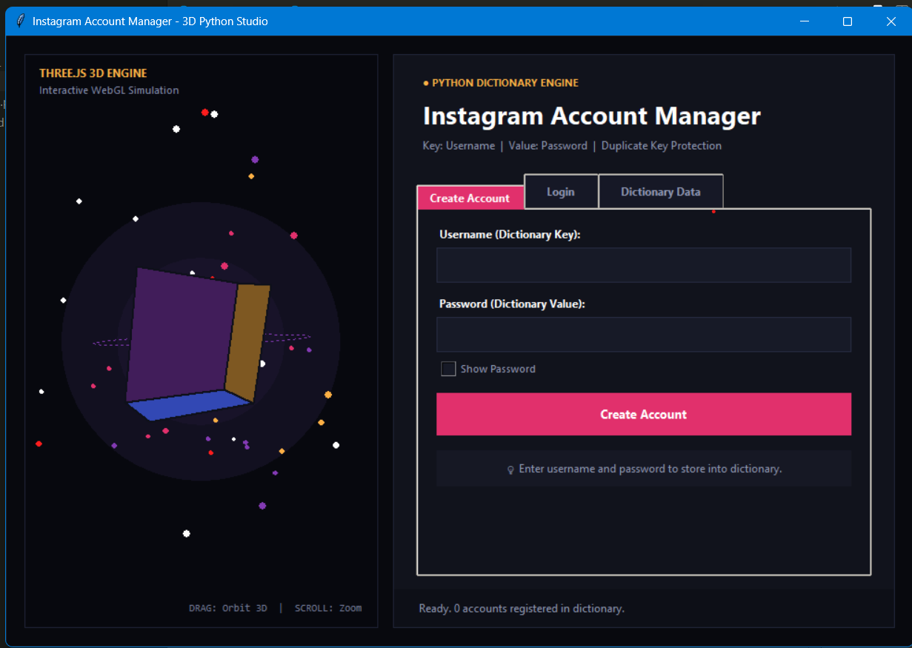
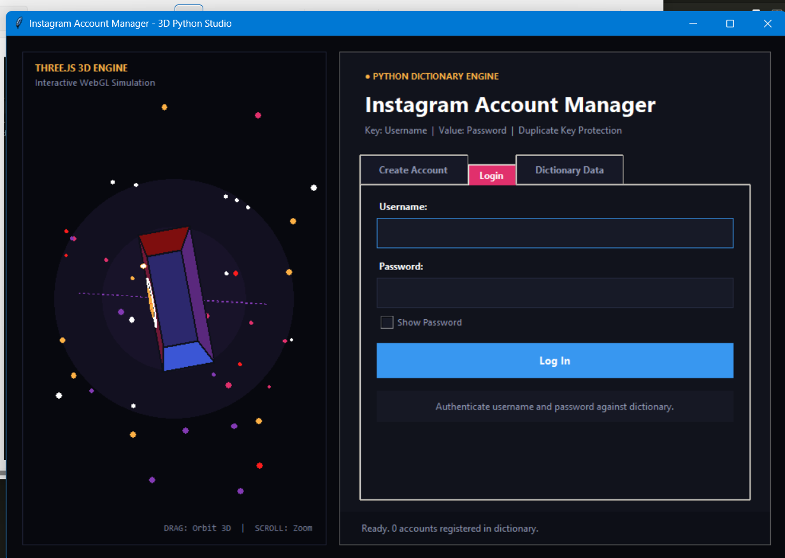
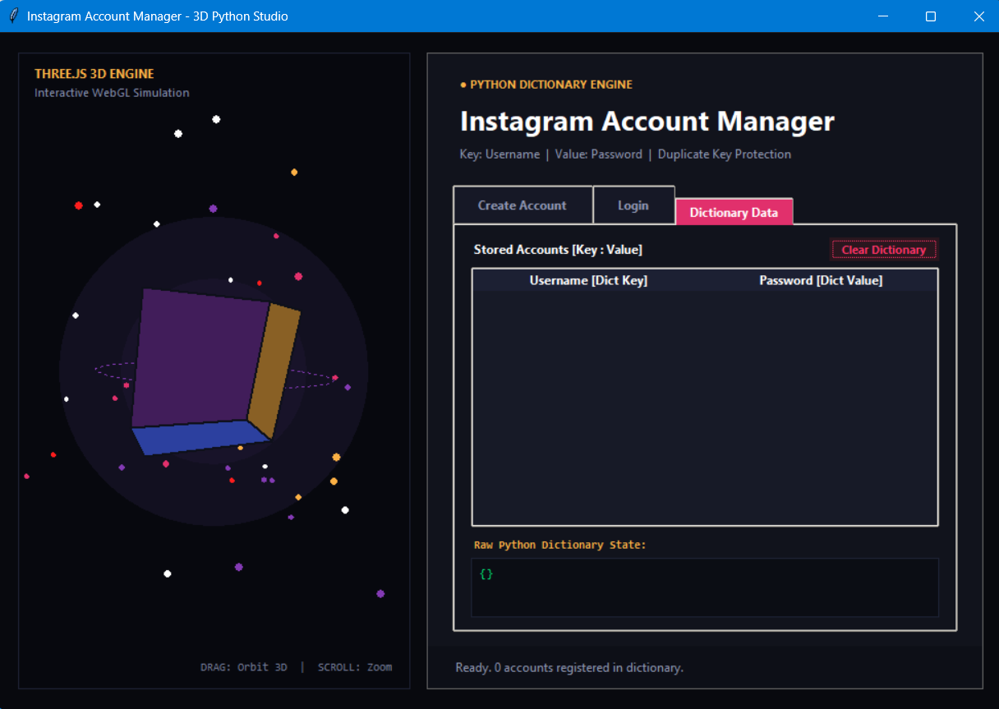

# 📸 Instagram Account Manager & 3D Studio (Python Desktop App)

An attractive, professional Python desktop application built with **Tkinter** that demonstrates **Python Dictionary data structures**, **duplicate key validation**, and a **real-time 3D Three.js simulation engine** without requiring any external web frameworks or pip packages.

---

## 📸 Screenshots & Visual Overview

| 3D Viewport & Account Creation | Duplicate Key Error Validation | Dictionary Data & Login |
| :---: | :---: | :---: |
|  |  |  |

---

## 🎯 Assignment Problem Statement
1. **Dictionary Storage**: Create a dictionary to store Instagram account credentials.
2. **Key-Value Mapping**: Store `username` as the **Key** and `password` as the **Value** (`{username: password}`).
3. **Duplicate Key Prevention**: If a user tries to create an account with an existing username, display an appropriate error message and prevent overwriting.

---

## 🧠 Core Concept: Understanding Python Dictionaries

### 1. What is a Dictionary in Python?
A dictionary is an unordered, mutable collection of **Key-Value pairs**:
```python
# Structure: {Key: Value}
user_database = {
    "kunjbosamiya": "secure@123",
    "alex_photography": "photo!2026"
}
```
- **Key** = `username` (must be unique).
- **Value** = `password` (associated with that specific username).

### 2. The Duplicate Key Problem in Python
In standard Python, if you assign a value to a key that already exists:
```python
user_database["kunjbosamiya"] = "old_pass"
user_database["kunjbosamiya"] = "new_pass"  # ⚠️ SILENT OVERWRITE!
```
Python will **silently overwrite** the old password without giving any error!

### 3. How We Solve It (Validation Check)
To enforce Instagram-like unique usernames, we check existence using the `in` operator **before** inserting:
```python
if username in user_database:
    # Key already exists! Reject and show error message
    messagebox.showerror("Error", f"Username '{username}' already exists!")
    return
else:
    # Safe to add new user
    user_database[username] = password
```

---

## 🔍 Step-by-Step Code Logic Breakdown

### 1️⃣ Account Creation Logic (`create_account`)
Located in [app.py](file:///c:/Users/Kunj_Khatri/red_white_project/classword/app.py):

```python
def create_account(self):
    username = self.reg_user_var.get().strip()
    password = self.reg_pass_var.get().strip()

    # Step 1: Prevent Empty Inputs
    if not username or not password:
        messagebox.showwarning("Input Missing", "Username and password cannot be empty.")
        return

    # Step 2: Check for Duplicate Key (Username)
    if username in self.user_database:
        # Trigger on-screen banner + modal error dialog
        messagebox.showerror(
            "Duplicate Username Error",
            f"The username '{username}' is already taken!\nIn Python dictionaries, keys must be unique."
        )
        return

    # Step 3: Add to Dictionary (Key -> Value)
    self.user_database[username] = password

    # Step 4: Show Success Message & Update UI Table
    messagebox.showinfo("Account Created", f"Account @{username} registered successfully!")
    self._refresh_ui()
```

---

### 2️⃣ Login Authentication Logic (`login_account`)

```python
def login_account(self):
    username = self.login_user_var.get().strip()
    password = self.login_pass_var.get().strip()

    # Case 1: Check if Key exists in dictionary
    if username not in self.user_database:
        messagebox.showerror("User Not Found", "Username does not exist in dictionary.")
        return

    # Case 2: Check if Password matches Value
    if self.user_database[username] != password:
        messagebox.showerror("Authentication Failed", "Incorrect password!")
        return

    # Case 3: Successful Login
    messagebox.showinfo("Welcome", f"Welcome back, @{username}!")
```

---

### 3️⃣ Live Dictionary Inspector (`_refresh_ui`)
- Updates the **Accounts Table** (`ttk.Treeview`) showing masked passwords with actual values.
- Updates the **Raw Dictionary State Box** displaying Python dictionary syntax:
  ```python
  {'kunjbosamiya': 'kunj@10122003'}
  ```
- Updates the bottom counter: `"Ready. X accounts stored in dictionary."`

---

## 🎮 The 3D Three.js Concept in Python Explained

The left viewport simulates **Three.js WebGL rendering** using native Python mathematics and `tk.Canvas`:

```
               [3D Vertices (X, Y, Z)]
                         │
                         ▼
             [Euler Rotation (Pitch & Yaw)]
                         │
                         ▼
        [3D to 2D Perspective Projection]
                         │
                         ▼
      [Lambertian Lighting & Depth Sorting]
                         │
                         ▼
            [Render to Tkinter Canvas]
```

### 1. 3D Model Vertices & Faces
The Instagram emblem is defined by 8 corner vertices $(X, Y, Z)$ and 6 polygonal faces.

### 2. Rotation Matrices (Pitch & Yaw)
When the user drags the mouse, rotation angles are updated:
$$\begin{aligned}
Y_1 &= Y \cos(\theta_x) - Z \sin(\theta_x) \\
Z_1 &= Y \sin(\theta_x) + Z \cos(\theta_x) \\
X_2 &= X \cos(\theta_y) + Z_1 \sin(\theta_y) \\
Z_2 &= -X \sin(\theta_y) + Z_1 \cos(\theta_y)
\end{aligned}$$

### 3. Perspective Projection Formula
To turn 3D points $(X, Y, Z)$ into 2D screen coordinates $(S_x, S_y)$:
$$\text{Scale Factor} = \frac{\text{FOV}}{Z + \text{Camera Distance}}$$
$$S_x = \text{Center}_X + X \times \text{Scale Factor}$$
$$S_y = \text{Center}_Y + Y \times \text{Scale Factor}$$

### 4. Depth Sorting (Painter's Algorithm)
Faces further away (larger $Z$) are drawn first, and faces closer to the camera are drawn on top to maintain true 3D depth perception.

### 5. Interactive Orbit Controls
- **Left-Click & Drag**: Spin the 3D model around any axis.
- **Mouse Wheel**: Zoom the 3D camera closer or further away.
- **Continuous Momentum**: When released, auto-rotation resumes smoothly.

---

## 🚀 How to Run

### Run the GUI Application:
```bash
python app.py
```

### Run the Terminal / Console Version:
```bash
python cli_program.py
```

---

## 📁 File Structure

```
classword/
├── app.py             # Main 3D Desktop Studio Application (Tkinter + 3D Engine)
├── cli_program.py     # Pure console interactive terminal version
├── README.md          # Comprehensive project explanation and documentation
├── imag1.png          # App screenshot (3D Viewport & Account Creation)
├── image2.png         # App screenshot (Duplicate Key Error dialog & banner)
├── imag3.png          # App screenshot (Dictionary Data Explorer)
└── .gitignore         # Python cache cleanup
```
